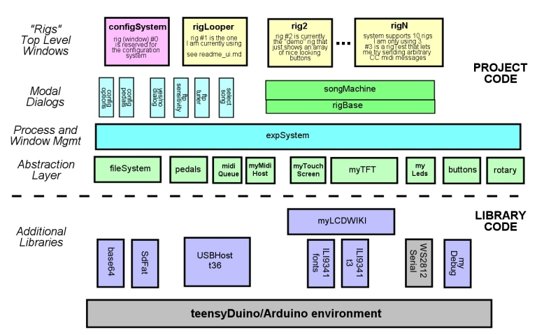

# Design (Software Architcture)

This page describes the software architecture for the teensyExpression ino
program.

For a discussion of the user interface (the "user manual"), please see
the [User Interface](readme_ui.md) readme file.


## Basic Architecture

The system can be viewed as a series of "layers", generally increasing in level
of abstraction as you move up the following diagram:

[](SoftwareArchitectureDiagram.jpg)

Everything above the dashed line, the **Project Code**, can be found in this repository.

Everything below the dashed line is in the *Arduino/libraries* folder (blue boxes) in
separate repositories available on my github page, and linked to from the main readme.md
file, or are (grey boxes) part of the basic **teensyDuino/Arduino** development environment
and easily available for public download.

Above the dashed line, the *teensyExpression* code, is organized somewhat as
follows.  There are a number of APIs (classes, objects) that represent an
**abstraction layer** of common functionality that are generally available to
higher layers.   This includes

- an abstraction of the SD Card FAT32 **fileSystem**.  The file system
  has it's own readme file at [readme_filesystem.md](readme_filesystem.md).
- an object that manages the four expression **pedals**
  including polling them and their functional behavior
- objects to process, and monitor **MIDI** io, including a
  *queue*, and handling both the main teensyDuino *USB midi* port,
  as well as the teensy 3.6 *midiHost* port
- a thin layer of abstraction of the **TouchScreen** and **TFT** display devices
- management of the ws2812 **LEDs**
- an object to manage and work with the 5x5 array of **buttons**
- an object to manage the **rotary controllers**

Above that, the **expSystem** is the main active object in the system.
It initializes all of the subsystems and does the bulk of event management,
in one of three ways: either by being called directly from the
teensyExpression.ino loop() method, or via one of two timer
interrupts:

- **updateUI()** is called directly from the main INO *loop()* method.
  This is the "UI thread" and is not considered time critical. All
  redrawing of the screen, and most updating of the LED colors,
  as well as certain processing of non-critical events happens
  in updateUI().
- **criticalTimerHandler()** is called up to 1000 times per second
  and handles the most time critical task, which is to
  transfer incoming midi from the midi-host port to the main USB
  midi port as rapidly as possible for live peformance.
  It also generally enqueues all midi
  messages for further processing and toggles the midi-activity
  indicator states for re-display in *updateUI()*.
- **timerHandler()** is called up to 200 times per second and
  does the bulk of the work in the system, including calling
  methods to poll the *pedals* and *buttons*, process the *serial
  ports* for incoming serial midi or file system traffic, and
  to process the *midiQueue* for midi monitoring and (FTP and
  external Looper) state changes.

Above the expSystem you have the main **Top Level Windows"** in
the system, which I call **"rigs"**.  There can only be one currently
active "rig" at a time, and those windows ALSO can implement
virtual versions of the *updateUI()*, *criticalTimerHandler(),* and
*timerHandler()* methods as they see fit.

Top Level Windows also get abstracted events from the expSystem
via the following virtual method calls:

- virtual bool **onRotaryEvent**(int num, int val)
- virtual void **onButtonEvent**(int row, int col, int event)
- virtual void **onSerialMidiEvent**(int cc_num, int value)

We will discuss **Rigs (Top Level Windows)** in more detail, below.

Finally, the expSystem manages various **modal dialog windows** that
can be popped (stacked) up over a given Top Level window.  Modal dialogs
can (and do) reprogram the buttons and LED colors as they see fit.
These modal windows include, at least conceptually, the following:

- **configOptions**, though not really windows, these are abstractions of
   configurable options that have a UI, and are stored as "preferences"
   (prefs.h) in EEPROM, and are managed by the **configSystem** (rig #0).
- **winConfigPedal** is a modal dialog that lets you edit the configuration
   of one of the four expression pedals, setting the basic *pedal type*,
   and within that one of three *curve types*, and the *curve points*
   that make up the curves.

The above are ONLY used by the configSystem.
The following are available for general use withing Rigs:

- **yesNoDialog** is a general purpose dialog to ask a question and get
  a yes/no (0/1) response.
- **winFtpSensitivity** is a modal dialog that allows you to display
  and adjust the sensitivity of the Fishman Triple Play pickup.
- **winFtpTuner** is a modal dialog that implements a guitar tuner
  using the Fishman Triple Play pickup.  It shows a "live" guitar
  fretboard, and typical guitar tuner UI.
- **winSelectSong** is a modal dialog that lets you choose, and/or
  view a **song file** which will run in the **songMachine**.
  The songMachine will also be discussed in more detail below,
  and in a separate readme file.


## Rigs (Top Level Windows)

The idea behind **"rigs"** is that you can have completely different setups,
that can do completely different things, with completely different user
interfaces and behaviors.

I have, in the past, used Rigs to differentiate, for instance, between
a tested, and gig ready piece of code, and another in-progress experimental
approach to some given hardware.

As currently checked-in (implemented) **I am only making use of one
actual functioning "rig"**.  I call this the **"LooperRig"** (*rigLooper.h
and cpp*), and it will provide the basic example, and documentation,
of "how the teensyExpression works" at this time.

The checked in source code *DOES* include two other "rigs".  One is
a **"demo" rig** that does nothing more than set all 25 leds to a nice
set of colors (as seen in the main photos of the pedal), and the other
is a vestigial piece of code, a **"test" rig**, that I created at one point
to allow me to send arbitrary MIDI CC messages and values to devices
for testing purposes.

Finally, it is important to note that the **"configSystem"** that
lets you modify, and retain settings through re-boots via "preferences"
stored in EEPROM, is implemented as rig #0, and so **rig number (0)
is reserved** and there is some special handling in expSystem.cpp
related to it, namely that *the top right button of every rig is
automatically set by the expSystem to "go to" the configuration
system (rig 0) on a **LONG CLICK***.

Apart from that, a rig "takes over" all of the buttons, LED display
characteristics, most of the display, and can have any arbitrarily
defined behavior.

## configurationSystem and rigLooper

A description of the user interface of these two rigs, which
currently pretty much constitutes the entire user interface at
this time can be found in the [User Interface](readme_ui.md) readme file.


## songMachine and rigBase

The main Looper Rig (rigLooper.h and cpp) derives from **rigBase**.
Top Level windows that derive from *rigBase* can interact with,
and be driven by the **songMachine**.

The *songMachine* is an interpreter that takes text files that
describe a state machine that can be used to further automate
and orchestrate complicated tasks.

For example, the Looper Rig is capable of allowing you to
choose, in real time, a given *Synthesizer patch* vis one
set of buttons, or to turn a given *guitar effect* on or off
via another set of buttons, and/or *control the looper*
via a third set of buttons.

So, in a typical example, you might select the "Bass"
synthesizer patch with one button, turn the guitar down
and the synthesizer up with the pedals, and then press
a button to trigger a loop to start recording.

In this *"realtime"* mode of using the pedal, it can turn
out that you spend all your time **looking at your feet!**
And that there are **complex** series of buttons you must
press to orchestrate a given live-looped song.  It can
also be very difficult to do things like "dial in" volume levels
via the expression pedals on the fly, say, for example,
if you want to mix the guitar with the synth in just a
certain way.

What I have found is that what you really want,
in a given song, at a certain time, is to cause a bunch of
stuff to change all at once, and that, in fact, all you are really
need to do, for a given song structure, is to provide
*timing cues* **WHEN** you want something to happen.

The songMachine *"takes over"* the bottom left four
buttons of the teensyExpression (of the rig that
starts the songMaching running), which are normally
the Looper *track1-4* buttons in the Looper Rig.

The provided
**text file** then tells the machine how to use those
four buttons, and *"loop events"* to send out MIDI
control signals to effect complicated behaviors
at gig time, **without needing complicated series
of (foot) button presses** or pedal changes to
accomplish them.

Typically an entire song can be orchestrated through
3 or 4 presses of one button.

The songMachine is also granted dedicated real estate
on the TFT screen to show the name and status of the
currently playing song, as well as two user-programmable
display areas.

Here is a short snippet of **"songmachine code"** that
may serve as an example.  Hopefully the comments are descriptive.

``` ruby
# INTRO and CHORUS 0

    # the program is executed from the beginning of the file
    # as soon as the song is "loaded"

    start:
        CLEAR_LOOPER                    # clear the looper to start
        LOOP_VOLUME 63                  # set looper to a known volume
        SYNTH_VOLUME 0                  # turn the synth all the way down
        GUITAR_VOLUME 70                # set the guitar to a known volume
        SYNTH_PATCH Bass1               # pick a synth patch for later use
        GUITAR_EFFECT_NONE              # turn off all guitar effects
        BUTTON_COLOR 4,yellow           # make 4th button from bottom left yellow
        BUTTON_COLOR 1,orange,FLASH     # make the first button flashing orange
        DISPLAY 1,"INTRO"               # display the part of the song we are in
        DISPLAY 2,"sing intro"          # display instructions about what to do here

        # the machine "blocks" on button1-4 or loop labels.
        # it advances to the next "buttonN" if that button is
        # pressed, or "loop:" label if the looper cycles through
        # a loop ...

        # In this example you play the intro, and then when ready, press the
        # 1st button to start recording the chorus ....

    button1:                            # when you press button1 the following happens:
        LOOPER_TRACK 1                  # start the looper recording
        BUTTON_COLOR 1,red              # set the button to red to indicate recording
        DISPLAY 1,"CHOR0"               # display the part of the song we are in
        DISPLAY 2,"recording base clip" # display what's going on at this time

# LEAD 0 - Acoustic guitar fill thru base clip

        # once you press the button again, it starts playing the loop,
        # turns on the guitar echo so you can play lead over it ...

    button1:
        LOOPER_TRACK 1                  # end recording
        delay 10                        # 10's of a second to allow for good loop end recording
        GUITAR_EFFECT_ECHO on           # turn on the echo effect
        BUTTON_COLOR 1,green,FLASH      # change button to green flashing
        DISPLAY 1,"A-LEAD"              # display stuff ...
        DISPLAY 2,"play acc lead\nready bass"

        # ready bass - you press this button at the end of the
        # guitar lead but BEFORE the loop happens to fade
        # out the guitar and fade in the bass before recording it.

    button1:                            # press this BEFORE loop ends!
        BUTTON_COLOR 1,red,FLASH        # show red flashing button
        GUITAR_VOLUME 0,20              # bring guitar down over 2 seconds
        SYNTH_VOLUME 85,20              # while bringing synth up over two seconds
        DUB_MODE                        # set dub mode to ...
        LOOPER_TRACK 1                  # start recording on next loop
        DISPLAY 2,"ready record bass"

# VERSE1 and CHORUS1 - while recording bass

        # the next time the looper comes around, the song
        # machine will get the "loop" event and trigger
        # the following section of code ...

    loop:
        BUTTON_COLOR 1,red              # button to red
        DISPLAY 1,"VERSE1"              # what part of song are we in?
        DISPLAY 2,"recording bass1"     # what the heck are you supposed to be doing now!

    ... and so on

```

The above example lets you play an intro, then record a straight guitar part,
then play lead over it, then start recording bass over that, with only two button
presses.  The chosen synth patch, volumes and effects are determined by the code.
All you do is tell the machine **WHEN** to change state ...

More info on the songMachine and the songMachine language
can be found [here](readme_songmachine.md).


## Note on Pedals and Display Areas

The handling of the expression pedals is *system-modal*.   That is to say,
the behavior of the pedals is not really bound to any given rig and the pedals
**continue to work** when you go to the configurationSystem and return to
a given rig (anywhere in the program).

This is because, in the real world, you may (probably) want to keep playing
the guitar while possibly changing configuration options, and certainly
at least want the ability to stomp on the pedals and turn everything down,
regardless of anything else that is happening, anywhere in the program.

So, although Rigs can affect the modal behavior of the pedals (set their
CC's and behaviors), the pedals themselves (pedals.h and cpp) actually send
out the pedal MIDI CC messages, and **there is no "Top Level Window" or
expSystem "onPedalEvent()" method**.

Also, here, it is worth noting that the TFT screen generally always presents
a **"title" bar**, which includes the context (rig name, configuration
option name, or modal dialog title) and the *midi activity* and *FTP battery level*
indicators.  Likewise, generally speaking, within Rigs **(all rigs) display the Pedal
Values portion** of the TFT screen, whereas the configSystem and dialogs
do not display them (though the pedals continue to work).

So the *"client area"* of the screen for a rig excludes the title bar and
pedal display area, and for all other windows, including the configuration system,
the client area excludes the title bar area.

These rectangles are publicly available in expSystem.h for general use.


## Final Notes

### *Patch* is a heavily overloaded term.

So I chose the term **"rig"** instead of **"patch"** to avoid confusion
with the things *THIS* teensyExpression pedal does (*rigs*) and *"patches"* that
might be selected on a synthesizer or other device in accordance with
their previously established terminology.


### Creating a new Rig

Just derive a class from *expWindow* or *rigBase*.  In it's begin() method
set the buttons up how you want them by calling **theButtons.setButtonType()**.
Add an **onButtonEvent()** method that responds to the button presses
and does what you want (like sending out midi CC messages).

Then modify **expSystem.cpp** to instantiate the rig, and away you go!!

That's pretty much it.

See the various API's (*buttons.h, myLeds.h, myTFT.h, etc*) for details on how
you affect the display and LEDs, and see **rigLooper** or one of the other
existing rigs for clues on how to send midi events upon button presses.
