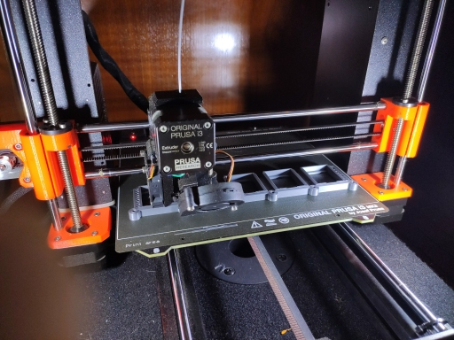
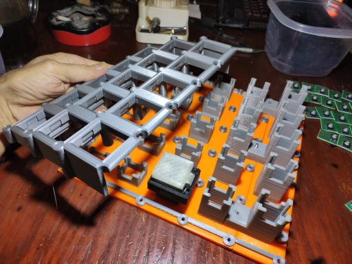

### teensyExpression Fusion, STL, and gcode files

## Hours/Grams to Print

- Display Case	1:58	36.34
- Display Ins	1:34	30.47
- PCB Base		1:09	20.66
- Fastners		0:25	4.61

- Frame5 		7:33	150.35
- Frame4		5:49	117.26
- Frame3		4:45	93.88
- Frame2		3:31	69.95
- Frame1		3:13	65.23
- Top1			2:30	48.97
- TopMiddle x3	2:35	49.17
- Top5			2:49	53.66
- TopLeft		1:41	32.42
- TopRight		2:02	38.82
- Back			2:34	53.05

The file 2020-06-02-MidiPedalFinal_with_fixes v9.f3d contains the most recent, and
most correct, version of the design of this thing.

But I don't believe it contains the actual switches themselves, which were
probably last exported from 2020-05-19-MidiPedal2 v4.f3d

THIS IS THE INITIAL CHECK IN.

I will clean these up and provide a single fusion file, and set of STL
and Prusa specific m3f and gcode files by the time I post this to
thingeeverse.

For now I just wanted to get a version up on the web.

ALL OF THIS IS USER BEWARE, of course!

Use at your own risk!
