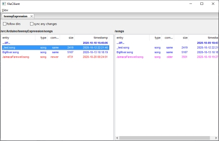
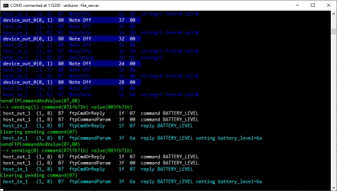

# The FAT32 fileSystem

This page describes the **fileSystem**.

The fileSystem is currently ONLY *used* by the [**songMachine**](readme_songmachine.md) to
read **.song** files from the */songs* directory on the SD card.

The fileSystem also presents a *Serial File Transfer Protocol*, which
allows one to transmit, retrieve, rename, and delete files anywhere on the SD
card, over *either* the main teensy 3.6 USB Serial Port *OR* the serial port
presented on the back of the teensyExpression as a 1/8" jack, depending
on the configSystem setting of the **System-File System Port** preference.


## API for use by program

Once initialized (by *expSystem.cpp*) clients make use of the
*SdFat* API, specifically, that of the global *SdFatSdio* **"SD"** and *File* objects
therein.

For example, here's how you open and read a file:

```c++

    File the_file = SD.open("/blah/blah.txt");
    if (the_file)
    {
        uint32_t size = the_file.size();
        char buffer[size];
        uint32_t got = the_file.read(buffer,size);
        if (got != size)
        {
            // error - could not read file
            the_file.close();
            return 0;
        }
        else
        {
            // it worked, "buffer" contains the file
        }

        the_file.close();
    }
    else
    {
        // error - could not open file
        return 0;
    }

```


## Serial Communication File Transfer Protocol (vs Serial Midi)

The expSystem is continually monitoring the main teensy USB Serial port,
and/or the additional 1/8" serial data port on the back of the box for
incoming **serial midi** or **file system commands**.

If it sees something that starts with 0x0B ... the standard USB MIDI
packet protocol 0th byte for a CC message, it assumes the next three
bytes will be a MIDI CC message, so it reads those three bytes and
calls the Top Level window's **onSerialMidiEvent()** method with
the given CC number and value.

Otherwise, it assumes that the incoming data is **text**, and will
buffer it upto a line termination character (\n) and then determine
if it is a **file system command** based on if it starts with the
string *file_command:*.

**File Commands** have the format:

```Text
    file_command:verb params
```

All file commands should return a serial data stream that includes
at least one line of text that starts with **"file_reply:"**.
If there is an error encountered (i.e. path not found) the file
reply line will contain the word **ERROR** followed by some descriptive
text, as below

```Text
    file_reply:ERROR The file '/blah.txt' was not found
```

A number of commands respond with a line that starts with **file_reply:OK**
to indicate success.  Below are the specific commands and specific
success returns.


### **list** *recurse*,*path*

  Will return a directory listing of the given path.

  If *recurse* is '1' (as opposed to '0') the listing
  will be recursive to include subdiretories.

  For each directory encountered there will be a **file_reply:Directory Listing *ts*,*path***
  line, followed by zero or more **file_reply:*ts*,*size*,*filename*** lines for files or
  **file_reply:*ts*,*subdir/*** subdirectory lines (**ts** stands for "timestamp", and
  subdirectories include a terminating forward slash for clarity in parsing).

  So, for example, you might ask for a listing of the */song* directory with this

```Text
    file_command:list 0,/songs
```

  And the returned serial stream of text lines might look like this:

```Text
    file_reply:Directory Listing 2020-10-18 12:00:01,/songs
    file_reply:2020-10-19 12:00:01,some_sub_directory/
    file_reply:2020-10-20 12:00:01,3817,BigRiver.song
    file_reply:2020-10-21 12:00:01,5200,JamaicaFarewell.song
```

  The above shows a directory listing of the **/songs** directory,
  created on Oct 18th, that contains a subdirectory named **some_sub_directory**
  that was created on Oct 19th, and two files, 3817 bytes in **BigRiver.song**
  created on Oct 20th, and 5200 bytes in **JamaicaFarewell.song**.

### **mkdir** *path*

  make the given directory (and any needed subdirectories).

  It is an error to try to create a directory that already exists.

  Will return **file_reply:OK - created_directory** upon success.

### **get** *filename*

  Get the given file.

  A successful return will begin with a
  **file_reply:FILE *ts,size,filename*** response, giving
  the timestamp, size, and full path for the filename.

  This will be followed by zero or more "bare" file_reply: lines that
  will contain base64 (text) encoded bytes, and a terminating **CHECKSUM**
  line, which is merely the 32bit unsigned sum of the individual (unencoded)
  bytes.

```Text
    file_reply:FILE 2020-10-20 12:00:01,123,/songs/blah.txt
    file_reply:9879874987498772498742982498724987439874329877324987324987234
    file_reply:9879874987498772498742982498724987439874329877324987324987234
    file_reply:9879874987498772498742982498724987439874329877324987324987234
    file_reply:CHECKSUM 12345
```

  The client is responsible for decoding the base64 bytes, calculating the
  checksum, and making sure it matches that sent in the final line of the
  reply.


### **put** *ts,size,dir,filename*

  Put the (following) file
  onto the SD card with the given **timestamp** *ts*, **size**,
  in the given **dir**ectory with the given **filename**.

  **Put** requires that the client do some handshaking before sending the file
  to the teensyExpression fileSystem.

  If the fileSystem determines that it can create the given file of the given size,
  after receiving the initial **file_command:PUT ts,size,dir,filename** it will respond
  with a line consisting of **file_reply:OK PUT STARTED**.

  When the client receives this, it may then send zero or more **BASE64** lines to
  the system, with a terminating **CHECKSUM** command, like this:

```Text
    file_command:BASE64 9879874987498772498742982498724987439874329877324987324987234
    file_command:BASE64 9879874987498772498742982498724987439874329877324987324987234
    file_command:BASE64 9879874987498772498742982498724987439874329877324987324987234
    file_command:CHECKSUM 12345
```

  If everything went ok, the fileSystem will reply with one final **file_reply:OK CHECKSUM**
  response (or a **file_reply::ERROR** of some kind)

### **delete** *path_or_filename*

  Deletes the given file or (dangerous!) the given
  ENTIRE subdirectory tree.

  Upon success, the file system will reply with a line like

```Text
    file_reply:OK DELETE is_dir
```

  Where "is_dir" will be 1 if it deleted a directory, or 0 if it deleted a file

### **rename** *old_path_or_filename*,*new_path_or_filename*

  Rename the given file or path.

  Upon success the filesystem will reply with a line like:

```Text
    file_reply:OK DELETE is_dir,size,ts
```

   Where "is_dir" will be 1 if was a directory, or 0 if it was a file,
   "size" will be the size of the deleted file, or 0 for directories,
   and ts will be the timetamp of the deleted item.


### Final Note on File System Serial Communications

There exists an as-yet-unpublished Windows **fileClient** application that I wrote
that can make use of the above protocol to present a nice explorer-like
user interface that allows you to easily move files between the teensyExpression
SD card and the Windows development environment.

[](images/file-client.big.jpg)

I *may* publish that program at some point.

Furthermore, that UI application works with my also-as-yet-unpublished putty-like
perl **CONSOLE** serial port monitor program, that, in turn, works with the
Arduino development environment to open and close serial ports as necessary
to ensure that Arduino (teensy) builds take place properly and can be uploaded.

[](images/file-console.big.jpg)

The above image shows *a little* of the capabilities of the CONSOLE program.
Like putty, it uses ansi color codes.  So it can display debugging and midi-monitoring
messages using different colors to distinguish between things, like errors coming
up in red, or warnings in yellow.

Furthermore, on top of that, that  CONSOLE program works with my
[**teensyPiLooper**](https://github.com/phorton1/Arduino-teensyPiLooper)
program, that runs on a teensy 3.2 inside of my bare metal rPi based
[**Looper**](https://github.com/phorton1/circle-prh-apps-Looper) project.

The perl CONSOLE and teensy3.2 teensyPiLooper programs, as well as working
with this fileSystem, also work with the
[**Circle rPi bare metal bootloader** ](https://github.com/phorton1/circle-prh)
that I wrote that allows you to develop and compile
bare metal rPi programs on Windows and easily upload them (*kernel.img*) via serial
data to the SD card on the rPi (without swapping the the SD card in and out).

So, even when the teensyExpression main USB port is plugged
into the iPad (or a USB router to the iPad), that you can STILL communicate
with the teensyExpression fileSystem, via the fileClient, CONSOLE and teensyPiLooper
programs, to access and work with files on the teensyExpression with an explorer-like
user interface ... even though the teensyExpression is NOT plugged into the windows
machine!

I use this to update **song files** as I am developing them (editing them in a
simple text editor, like Notepad, on Windows),
so that I can play them, in the songMachine on the teensyExpression, in vitro, while IT
is connected to the iPad, without having to change any cables.

It's very complicated to explain, and I hope a video demonstrating this,
and some of the other capabilities of my development environment,
will be forthcoming.


----- end of readme_filesystm.md ------