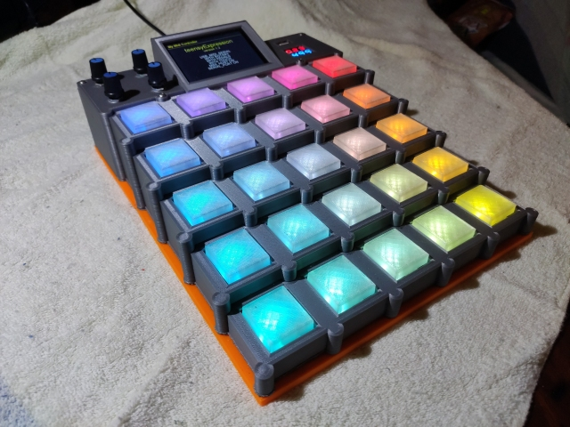
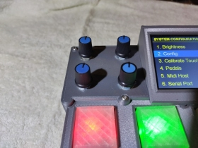
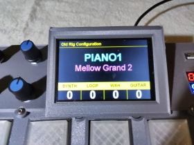
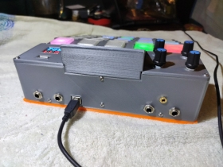
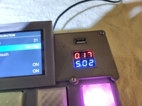
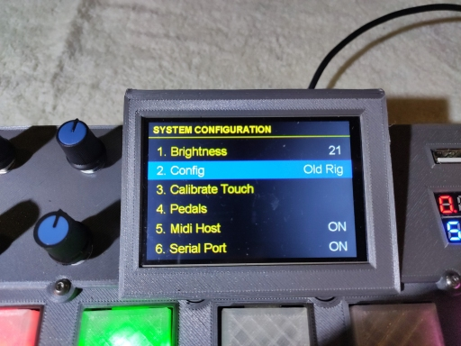

# teensyExpression MIDI controller

This github repository describes and contains the source code and other materials
for a 3D printed, **teensy 3.6** based MIDI controller.  The controller has a 5x5 array
of switches, each with an individually adressable ws2812B colored LED,
four rotary controllers,
a 3.5" touchscreen,
inputs for four (4) standard 1/4" expression pedals, a 1/8" stereo jack used for a serial port, and the main USB type "A" connector,
a USB host port, and, lol, a volt/amp meter to monitor the USB power supply.

*four rotary controllers*

*3.5" touchscreen*

*inputs for four (4) standard 1/4" expression pedals, 1/8" stereo jack for serial port, and the main USB type "A" connector*

*USB host port, and volt/amp meter on USB power supply*

It is intended to be a *foot* controller ... hence the tiered setup which makes it
easier to press buttons with your toes without having to reach over other buttons.
FWIW, I play the guitar barefooted, while sitting in a chair.

There are two major aspects to this project.  First there is the [**hardware**](hardware.md), which is
relatively straight forward, and there are circuit diagrams, fusion 360 files, some
instructions, and so on that might allow someone to create a copy if they wanted to.

The second major aspect is the [**software**](design.md). Inasmuch as this was conceived as BOTH an
experimental platform to let me mess with USB midi, and particularly the **Fishman FTP
Triple Play** dongle/controller, it also has been programmed to fit into my existing
performance setup.  For me, it is "gig ready", as well as a place I can try different
experiments with various things.

The software does not present itself as a general purpose, commercially viable,
consumer product.  Though that could be done, it is not my primary focus. So, while
I would be able to create, for example, a box on which the end user could map the
buttons to various MIDI CC control messages at "run time", that is not currently
implemented.

Because the entire thing can be (fairly) easily programmed from the Arduino IDE,
at this time I am selfishly doing whatever the heck I want in C++.   Some stuff
has been modularized and incorporated into things like a system configuration "preferences"
page, with persistent values stored in EEPROM, other stuff is "hard coded" into the C++, an
approach which limits the use of this by less technically saavy "consumer" or "nubie"
readers and potential users.

That's what it is.

There is still, in my opinion, considerable value in making this public, and so,
here, in spite of ongoing development, I am creating a public github
repository so that I can present it to you.

## THIS Repository Organization

TODO: rework this whole section

This repository contains the C++ source code,
  including the main INO file (teensyExpression.ino) and the C++ and H files
  needed to build the program.

There are a number of other sub-folders which are considered "private" for my own
personal use, and/or which exist only to support the readme.md files in the this
and the above subfolders:

* **images** - contains images used on this and various readme pages
* **junk** - contains a variety of weird files, images, doc files, that, for me, pertain
      to the design of the project, but which are not meant to be necessrily useful
      for a reader or anyone besides myself.
* **tests** - contains a number of test programs that are not necessarily currently up-to-date
    or useful.  I keep these for posterities sake as they may have snippets of code I will
    need in the future.

### 3D Printing Information

There is a separate repository containing the Fusion 360, STL, and gcode files
for this project that were used to 3D print the box and buttons.

TODO: rework

### Please See

This teensyExpression pedal is intimately involved with my long term ongoing
**[rPi bare metal vGuitar rig](https://hackaday.io/project/165696-rpi-bare-metal-vguitar-rig)**
project at hackaday.

In that process I have developed a number of other repositories which might be of interest
to audio system development hackers, including:

* **[circle](https://github.com/phorton1/circle)** - my fork of a a C++ bare metal rPi
development framework
* **[circle-prh](https://github.com/phorton1/circle-prh)** - my extensions to Circle, including
a port of the **Teensy Audio Library** to rPi bare metal, and an Arduino like development
approach.
* **[Loooper](https://github.com/phorton1/circle-prh-apps-Looper)** - a bare metal rPi based **Audio Looper**
including a 3D printed case with a 7" touchscreen, which hooks up to, and is controlled by,
this teensyExpression pedal.

### Notes on Building and GitHub **DEPENDENCIES**

This project relies on the teensyDuino installation.

It also depends on a number of Arduino libraries that must be manually placed in your
Arduino/libraries folder.  There is one small library that I wrote (myDebug.h and myDebug.cpp),
that I generally use in my Arduino programs, and is common to more than one of my published projects.

In addition there are several libraries that are publicly available, but unchanged by me
(ILI9341_t3 and ILI9341_fonts), which I have forked into my github account for ease in finding them,
and to provide me with a stable known "snapshot" of those libraries.

And finally there are some libraries that are publicly available, but to which I
have made modifications to, small or large, in order to get them to work in this project
(Paul's USBHost_t36 and my_LCDWIKI_*).

Each of these libraries is available as a github project here in my account, with a
name that is formatted like "Arduino-libraries-NameOfLibrary".   **These libraries
should be "cloned" or otherwise copied into your Arduino/libraries folder**.  Once
you have done that, you may rename them to remove the "Arduino-libraries" portion,
just leaving the NameOfLibrary portion in the directory structure if you wish.

* [myDebug](https://github.com/phorton1/Arduino-libraries-myDebug) -
   A debugging output library common to my Arduino projects, it contains
   global methods with names like "display" and "display_bytes" which are called
   throughout my code, and which can be turned on or off via defines.

TODO: cleanup NEEDS vs USES forked libraries

* **base64** -
  UNMODIFIED fork of Adam Rudd's https://github.com/adamvr/arduino-base64 repository
* [ILI9341_t3](https://github.com/phorton1/Arduino-libraries-ILI9341_t3) and
  [ILI9341_fonts](https://github.com/phorton1/Arduino-libraries-ILI9341_fonts) -
  These are UNMODIFIED versions of Paul's ILI9341 libraries, forked from
  his repository on 2020-10-03.   My program *may* compile and work with
  more current versions that he makes available at https://github.com/PaulStoffregen/ILI9341_t3
  and https://github.com/PaulStoffregen/ILI9341_fonts, but these forks are
  known to compile and work properly with my code.

* [USBHost_t36](https://github.com/phorton1/Arduino-libraries-USBHost_t36) -
  A slightly MODIFIED version of Paul's USBHost_t36 library, forked
  from https://github.com/PaulStoffregen/USBHost_t36 on 2020-10-03.
  The API was changed to make a few functions virtual and to expose
  a few private variables as "protected".

* [SdFat](https://github.com/phorton1/Arduino-libraries-SdFat) -
  A fork of Bill Greiman's https://github.com/greiman/SdFat with one slight
  modification - to increase BUSY_TIMEOUT_MICROS from 500000 to 1000000,
  which fixed problems I was having opening an SD card on a fresh boot.

* [my_LCDWIKI_GUI](https://github.com/phorton1/Arduino-libraries-my_LCDWIKI_GUI),
  [my_LCDWIKI_KBV](https://github.com/phorton1/Arduino-libraries-my_LCDWIKI_KBV), and
  [my_LCDWIKI_TouchScreen](https://github.com/phorton1/Arduino-libraries-my_LCDWIKI_TouchScreen) -
  These repositories contain the rude and crude port of the LCDWIKI Arduino libraries
  to the Teensy for the cheap touch screen I ended up using.  The touch screen
  is an 8 bit parellel port screen that looks like this:

  

When I started working on this project, I started off using a different, much
faster and more teensy compatible 2.8" SPI touch screen.  One night I burned it, and
because I did not want to wait 6 weeks for a replacement (I live on a remote
island in the tropics) I was forced to go to a slower speed 8 bit parallel
Arduino touch screen ... which in turn required me to port the LCDWIKI library
for it to the teensy 3.6, which I did.

# Credits

Pretty much everything I do has been tremendously influenced by, and is more or less a direct
result of the work done by **Paul Stoffregen** and his wonderful **teensy** series of MPU boards.

Please visit his website at [prjc.com](https://www.prjc.com) and support him by purchasing teensy
boards and teensy related parts and accessories.    He also has github, hackaday, and facebook pages
that you can find easily on the internet. The man's a giant to me, and has forged important new
ground not only with the boards he makes, but also with the **vast** amount of open source
software he has created, not the least of which includes the ws2812 and ili9431 libraries, but
also his audio library, and well, what can you say ... so much more!

Also thanks to the many folks who have contributed to the [lcdwiki](http://www.lcdwiki.com) project.
Though I can't name them by name, many are the times when I have visited their website and utilized
their code.

That's it!

Thanks for checking this out!

Updated October 2020 - Patrick
