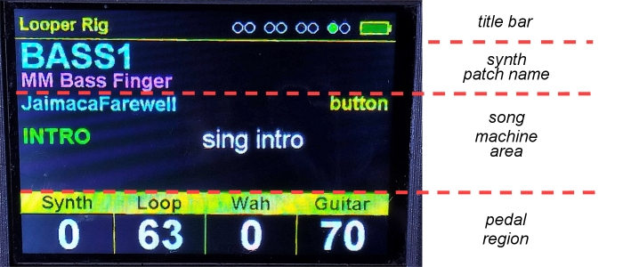
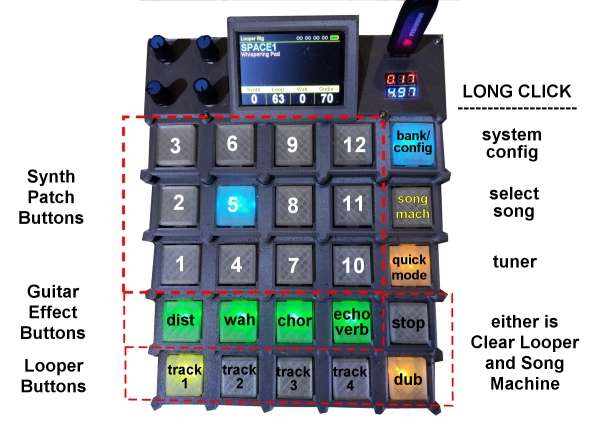
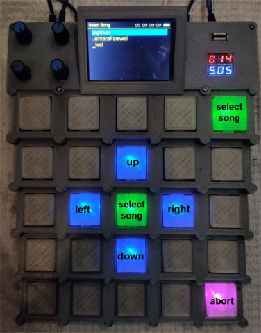
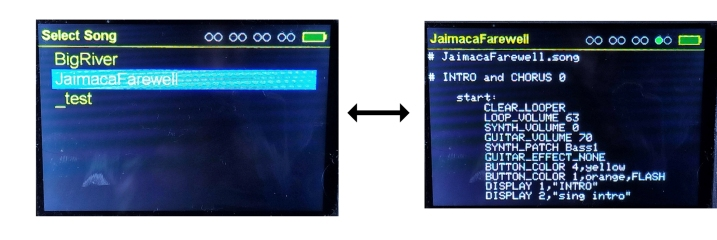
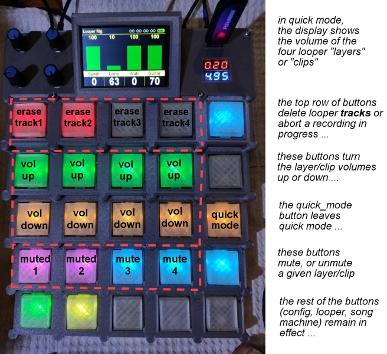
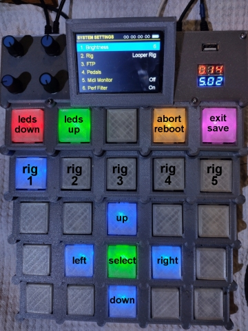
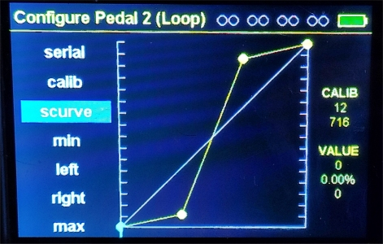
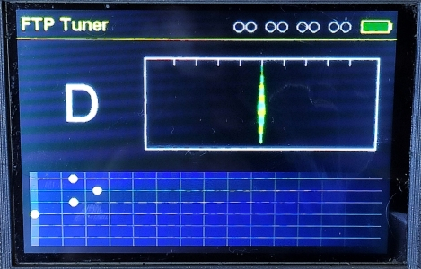
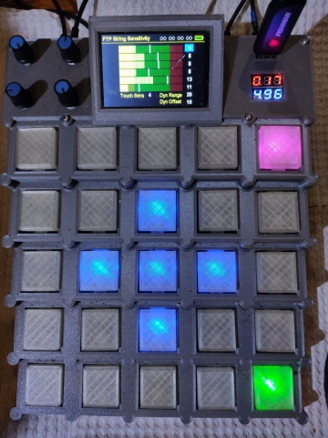

# Design (User Interface)

This page describes the software user interface, as currently implemented,
of the teensyExpression pedal.

For a discussion of the software architecture (how it works), please see
the main [Design](readme.md) readme file.


**--------------------------------------------------------------------------------**

## **the Looper Rig**

The Looper Rig (rigLooper.h and cpp) present the main user interface that I use while playing guitar.

There are four expression pedals plugged in, for, respectively,
the Synthesizer volume, Loop volume, Wah Wah (expression) pedal, and Guitar Volume.

The Looper Rig is the only code that makes use of the Rotary Controls at this time.
They are used to control the (bare metal rPi) Looper's INPUT, THRU, MIX, and OUTPUT volumes,
respectively.

### Screen

The Looper Rig screen shows several distinct regions.

At the top is the **title bar**, which includes the **title** of the current Rig, configuration option,
or dialog window, the **midi activity** indicators, and the **FTP battery level** indicator.

Below the title bar, the currently selected **Syntheizer Patch Short and Long names** are displayed
in large cyan, and smaller magenta, respectively.

[](images/ui-looper_rig1.big.jpg)

Below that is the songMachine area, which shows:

- on the first line, in cyan, the **name** of the current song (JamaicaFarewell in this case)
- on the first line to the right, in yellow (or red if an error) the **"state"** of the songMachine
  (waiting for a button press in this case)
- on the second line, to the left, the **first user programmable display area**, by convention
  usually used to show one word describing WHERE you are in the song (i.e. INTRO, VERSE,
  CHORUS, END, etc) in yellow or green.
- the second line to the right (the rest of the screen down to the pedal region) is given
  to the **second user programmable display area**, which is also where any errors
  would be displayed, or more usefully, your user programmed message(s) describing, perhaps,
  what you should be doing (i.e. "Sing the Verse NOW!!!") or what is coming
  (i.e. "Get ready to record the bass!"), usually in white.

At the bottom of the screen is the **"pedal" region**, which shows, in yellow, the current values
for the Synth volume, Loop volume, Wah Wah value, and Guitar volume.

### Main Looper Rig Buttons

The Looper rig buttons are divided into 4 different groups.

The first group, occupying the top 3 rows of the left most 4 buttons, are the **Synth Patch selection
buttons**.  They pick one of twelve patches on the synth, within one of two "banks".  The **BANK/CONFIG**
button is the upper right most button.  Short clicking it will toggle between the two banks of
12 synth patches, and it's color will change from CYAN to BLUE to represent bank 1 and bank 2,
respectively. The patches that are selected also show the bank number they were selected under
by turning either CYAN or BLUE when pressed.

[](images/ui-looper_rig1.big.jpg)

The second group of buttons, occupying the leftmost 4 buttons on the 4th row, are the
**guitar effect buttons**.   The buttons are, in order from left to right, *DISTORTION,
WAH, CHORUS,* and *ECHO/VERB* respectively.  Pressing them toggles the given effect on and off.
When the effect is on, the button is lit in green, when it is off, the button is not lit.

*Long pressing* the rightmost guitar effect button (the ECHO/VERB button) will clear
**(turn off) all the guitar effects**.

The entire bottom row of buttons, plus the one above the right corner, are the **Looper
buttons**. They are, from left to right, the *TRACK1* through *TRACK4* buttons, the *DUB* button,
and above the DUB button, the *STOP* button.  *Long pressing either* the DUB or STOP button
will **clear the Looper** (and, if a song is loaded in the songMachine, it will clear the
songMachine too).

Finally there is the right most column of buttons, which from the top down, are,
respectively, the ***BANK/CONFIG button***, the ***SONG_MACHINE button***, the
**QUICK_MODE/TUNER button**, and as previously mentioned, the Looper STOP and DUB buttons.

*Long pressing* the upper right BANK_SELECT button **takes you to System Configuration mode**
(rig #0) as described later in this document, whereas a normal click merely toggles the selected
bank (color).

### Song Machine Button (loading songs)

*Long pressing* the ***SONG_MACHINE*** button brings up the *Select Song dialog*, which lets you
load a song into the song machine.  It uses the usual blue button arrow pattern seen
elsewhere in the system:

[](images/ui-select_song.big.jpg)

While in the Select Song dialog, the blue ***UP*** and ***DOWN*** buttons move between songs,
whereas the ***LEFT*** and ***RIGHT*** buttons show you the contents of the
text file, or move back to the list.  Within this dialog, the green buttons mean ***SELECT
SONG***, which will cause it to be loaded and started running, and the magenta button
means ***ABORT*** without loading a song.

[](images/ui-select_song_combined.big.jpg)

When a song is loaded, the songMachine button changes to yellow, and a *short click* of the
SONG_MACHINE button toggles the songMachine between *"running"* (yellow) and *"paused"* (purple)
states.

When a song is loaded, and the songMachine is running, **it takes over the bottom left four (track) buttons**.
When it is not running, or no file is loaded, those four buttons revert back to the the normal Looper
TRACK1 through TRACK4 buttons.

Please see the [songMachine readme file](songmachine.md) for more information about
the songMachine.

**There is a small, kind of weird, overload of the songMachine button.**

*When a song is not loaded, a short click on the (blank) SONG_MACHINE button will set a
**LOOPER_MARK_POINT** in the current loop if any is playing.  If that happens, instead
of looping back to the beginning of the clips, the rPi Looper will start looping back to
the marked point, allowing you do things like "repeat the last phrase 3 times then end"*.

*This functionality was stuck here in lieu of a (quite likely) rework of the UI to
allow another row of looper control buttons (at the expense of one row of synth
patch buttons, recovered by increasing the number of synth banks from 2 to 3 or more).*

### Quick Mode Button (and Guitar Tuner)

I call it "Quick Mode" but you could also call it "Looper Mode".

A short click of the QUICK_MODE button will toggle between "normal Looper Rig Mode" and a mode
that takes over the synth patch select and guitar effect button areas and re-programs them to
allow you to MUTE/UNMUTE and adjust the volume of each the four clips (layers) within the currently
running Track on the Looper, if any.

[](images/ui-quick_mode.big.jpg)


The MUTE/UNMUTE buttons are blue if the clip is NOT muted, and they change to magenta if
the clip IS muted.  Above the MUTE/UNMUTE buttons are the VOLUME_DOWN (orange), and VOLUME_UP (green)
buttons.  Pressing these will adjust the volume of the given clip within the current track.

Finally the top row in Quick Mode is given over to track managment.   There are four
buttons that turn red if a track has been recorded.  If so, long pressing the button
will erase the track (and stop the looper if that track happens to be playing).
This allows you to re-use tracks for more complicated songs, or just get rid
of problems without necessarily throwing the whole set of clips away.

One of the buttons in this top row may be orange if that track happens to be
currently recording.  If so, a short click of the orange button will abort the
reording (and keep looping, if possible).  That is the "oops, messed up, bail"
button while recording.

A second short click of the QUICK MODE button will return you to "Normal Looper Rig"
mode, where once again, the synth patch and guitar effect buttons are in effect
and displayed.


*A long click of the QUICK_MODE button will bring up the FTP guitar tuner (described separately)*


**--------------------------------------------------------------------------------**

## **System Configuration** mode (rig #0)

The second main user interface in the system at this time is the *configuration/preferences*
code, which is called the **configSystem** (h and cpp files, respectively).

You enter **configuration mode** by *long clicking* on the upper right hand button
in any rig.   In the Looper Rig, that is the BANK/CONFIG button.  When in configuration
mode, the upper right hand button turns to magenta.

You exit configuration mode by pressing the upper right hand button.  A *short
click will* accept the modifications you made to the system configuration
**for this session only**, whereas exiting with a *long click* will save the
changes persistently to EEPROM so that they define the default state of
the device when it reboots.

So, for example, you can change the LED brightness, and if it's just for
temporary use, a short click exit will keep the change, but rebooting
will use the persistent preference.   A long click will set the LED
brightness (default) for the next time you reboot the machine.

[](images/ui-config_system.big.jpg)


The configSystem presents a general **up-down-left-right-select** pattern
of buttons, along with a few "special" (short cut or exit) buttons.

In general, you move the cursor up and down to to navigate to a
configuration option, then press the **select** button to modify
the value (or go deeper into the configuration hiearchy).  The
detailed configuration options will be discussed below.

The right arrow also typically means *go deeper into the configuration*.

The left arrow generally means *return to the previous page*, moving
back to the main configuation page.

In addition to the arrow-select keypad, there are a number of other
buttons for quicker access to certain parameters, or to reboot the
machine.

- the **top left red and green buttons** increase or decrease
  the LED brightness
- the **second row of buttons** lets you pick between rigs
  1 through 5, and shows the currently selected rig if it
  is in that range. In the above image, rig #1, the Looper
  rig is selected.
- the orange button second from the top right is the
  *abort* button.  Short clicking it will abort any
  changes you have made to the configuration and
  return you to the current rig (as opposed to
  clicking the top right button which **accepts**
  the changes).
- *long clicking the orange button* will **reboot the machine**.


### Configuration Menu Hierarchy

Details about certain settings will be provided below.

```
    1. Brightness                   NN      # sets the LED brighntess
    2. Rig                        name      # chooses different rigs
    3. FTP                         ...      # brings up the FTP submenu
    |  1. Spoof FTP             off/on      # turn FTP spoof mode on or off
    |  2. FTP Port     off/host/remote      # where is the FTP dongle?
    |  3. FTP Tuner                ...      # brings up the FTP tuner dialog
    |  4. FTP Sens                 ...      # brings up the FTP sensitivity dialog
    4. Pedals                      ...
    |  1. Configure Pedal1 (SYNTH)          # brings up the pedal configuration
    |  2. Configure Pedal2 (LOOP)           # dialog for one of the four expression
    |  3. Configure Pedal3 (WAH)            # pedals ...
    |  4. Configure Pedal4 (GUITAR)
    5. Midi Monitor                ...      # Midi Monitor Settings
    |  1. Midi Monitor      off/default/usb/serial      # where to send midi monitor output
    |  2. Ports                    ....
    |     1. Duino Input 0       off/on     # there are eight midi ports that can be monitored
    |     2. Duino Input 1       off/on     # each midi device has two ports
    |     3. Duino Output 0      off/on     # the "duino" ports are the main teensyDuino USB device
    |     4. Duino Output 1      off/on
    |     5. Host Input 0        off/on     # the "host" ports are the teensy 3.6 USB host device
    |     6. Host Input 1        off/on
    |     7. Host Output 0       off/on
    |     8. Host Output 1       off/on
    |  3. Channels                  ...     # you can filter midi monitoring by channel
    |     1. Channel 1           off/on
    |     ....
    |     16. Channel 16         off/on
    |  4. Message Types             ...     # you can filter midi monitoring by message type
    |     1. FTP Specific           ...     # there are a number of options for FTP specific messages
    |        1. ParsePatches     off/on     # Parse FTP patches into meaningful display? (requires sysex)
    |        2. Note Info        off/on     # Monitior FTP Note Info messaage
    |        3. Tuning Msgs      off/on     # Monitior FTP Tuning messaage
    |        4. Commands         off/on     # Monitor FTP commands
    |        5. Values           off/on     # Monitor FTP command replies
    |        6. Poly Mode        off/on     # Monitor specific FTP command/reply: PolyMode
    |        7. Bend Mode        off/on     # Monitor specific FTP command/reply: Bend Mode
    |        8. Volume           off/on     # Monitor specific FTP command/reply: Volume Level
    |        9. Battery          off/on     # Monitor specific FTP command/reply: Battery Level
    |       10. Sensitivity      off/on     # Monitor specific FTP command/reply: String Sensitivity
    |       11. Known Commands   off/on     # Monitor any other specific known FTP commands/replies
    |       12. Unknown Commands off/on     # Monitor umknown 1f/3f FTP commands/replies
    |     2. Sysex         ff/on/detail     # Monitor sysex messages, details=show contents
    |     3. Active Sense        off/on     # Monitor active sensing messages
    |     4. Note On             off/on     # Monitor Note On messages
    |     5. Note Off            off/on     # Monitor Note Off messages
    |     6. Velocity            off/on     # Monitor Velocity messages
    |     7. Program Chg         off/on     # Monitor Program Change messages
    |     8. Aftertouch          off/on     # Monitor Aftertouch messages
    |     9. Pitch Bend          off/on     # Monitor PitchBend messages
    |    10. Other CCs           off/on     # Monitor Any other CC's
    |    11. Everything Else     off/on     # Monitor Everying else
    6. Perf Filter                  ...     # Performance Filter settings
    |  1. Perf Filter            off/on     # Turn performance filter on or off
    |  2. Filter Bends           off/on     # Filter out pitch bend messages
    |  3. Monitor Perf           off/on     # Monitor the peformance MIDI messages
    7. System                       ...     # Change system wide settings (ports, etc)
    |  1. Debug Port     off/usb/serial     # Where to send program debugging output
    |  2. File Sys Port      usb/serial     # Which serial port to monitor for fileSystem comamnds
    |  3. Calibrate Touch           ...     # Calibrate Touch Screen (not implented yet)
    8. Factory Reset                ...     # Perform a factory reset (with confirmation dialog)
```

#### - Options Requiring Rebooting

Changing some options requires rebooting the machine.
If you change the following options you *should* be prompted with a
yes/no confirmation dialog, and if you **save** the options,
the machine will reboot.

- Factory Reset
- FTP Spoof Mode
- System Debug Port
- fileSystem Port

The machine can also be rebooted by long-pressing the orange **abort** button.

When the system reboots, the button will flash red for a few second before
actually rebooting.

#### - Factory Reset (default settings)

Performing a factory reset clears the EEPROM memory (writes 255's to it all).
This results in the default settings being used upon the reboot.

The default settings are to turn Midi Monitoring off, expect an FTP
dongle on the remote (main usb to the iPad) port, use Rig #1 (the
Looper Rig), and communicate with the (bare metal rPi) Looper via
serial midi.

#### - FTP Spoofing (explained)

When FTP spoofing is turned **off**, this device presents itself
as a compliant USB midi device with four ports

- teensyExpression IN 0
- teensyExpression IN 1
- teensyExpression OUT 0
- teensyExpression OUT 1

When FTP spoofing is turned **on** this device presents itself
**as an FTP USB device** with a different set of four ports:

- Fishman Triple Play - (in 0)
- Fishman Triple Play - (out 0)
- MIDIIN2 (Fishman Trple Play) - (in 1)
- MIDIOUT2 (Fishman Trple Play) - (out 1)

**IF you plug an FTP dongle into the USB Host port** and engage
*FTP spoof mode*, you may then plug this teensyExpression pedal into
your Windows machine, and can **run the Fishman FTP Windows**
application, and it will *see* the teensyExpression **AS**
a Fishman FTP device!!

You can then use the *Midi Monitoring* capabilities,
in conjunction with Putty or some other serial port
monitor, to *monitor and understand the conversation*
between the FTP dongle and the FTP editor program.

This functionality, alone, should be of value to any hard core
hackers that are trying to reverse engineer the FTP dongle.

Note that I belive that one *could* build the INO program **without necessarily
building the box**, run this program on a bare teensy 3.6,
and take advantage of, and use, these monitor features ...
with a little work ... by setting the defaults at bootup
to turn on the FTP spoofing.

**I would be very interested to hear if anyone can build
this source code!!**

#### - FTP Host Port and MidiFire on iPad

If the FTP port is set to **host** and you plug an FTP dongle
into the host port, it will work.

But, to use the FTP in **remote** mode, in my setup, I need
to run a program like **midiFire** on the iPad and *redirect
the FTP output* (for Channel 8, on which the FTP sends out
all of it's command/reply messages) **BACK to the teensyExpression**
input midi device.

The FTP Port must be setup correctly to use the ftpTuner
and ftpSensitivity dialogs, and/or to monitor the FTP
midi messages.

#### - System Debug Port and Midi Monitor Port

Debugging output from the program can be turned off, or
directed to either the main USB serial port, or the ancillary
serial port (the 1/8" jack on the back of the box).

The Midi Monitor output can "follow" the debugging output.
If it's port is set to "debug", it will use the setting
of the System Debug port for it's output.

Or the Midi Monitor can be specifically directed to
either the main USB or the ancillary serial port.

So, it is possible, if you desire, to (perhaps using
an rs232 USB Serial Dongle) to connect the Midi Monitor
to one console (instance of "putty") on your development
machine, and have the debugging output from the program
go to a separate different instance.

So you could have two serial "consoles" open to the
teensyExpression pedal at any given time.   This is
handy sometimes when you are debugging, but still
want to monitor the midi messages.

#### - Midi Monitoring, General and FTP specific

You can generally turn Midi Monitoring on or off, as well
as filtering on specific *ports* and/or *midi channels*.

In addition, you can choose to filter out (or show) specific
midi messages, like, for example, **sysex** which can be
shown as a single line, that just tells you how many bytes
of sysex were in the message, or it can include a dump of the actual
sysex bytes in the monitor.

If you are monitoring a Fishman FTP Triple Play Dongle,
you can also choose to further parse FTP sepecific messages,
including to display the contents of FTP patches in a
meaningfule manner as they are being slung back and forth,
and/or to interpret the
FTP **1f/3f** *command/reply* sequences.

For more information on my efforts at reverse engineering
the FTP Midi protocols, please see the
[ftp readme](ftp.md) file

TODO: Make a readme file specific to Midi monitoring
showing how it displays messages in differet colors
depending on the ports and message types, and demonstrating
how it can help to understand complicated MIDI conversations.


### **Pedal Configuration Dialog**

The **Pedal Configuration** dialog is available for each
of the four expression pedals.   As with the main system
configuration dialog, it presents a **blue button arrow/select
button pad**.

Within this dialog, you use the **up** and **down** buttons
to navigate to an item, for example, the *curve type* for the
pedal, and then use the **select** button to change the value.


[](images/ui-config_pedal.big.jpg)

The available curve types are

- **linear** - (a simple line) has only *max* and *min* points to edit
- **asympt** - (asymptotic) has *max* and *min* and one point, *mid* in the middle
- **scurve** - has *max*, *min*, and two adjustable points (*left* and *right*) in the middle

When you select one of the **points** for editing the curve,
all four arrows, *up*, *down*, *left*, and *right* may be used
to move the selected point around on the curve.  A subsequent
press of the **select** button then returns to allow you
navigate the pedal configuration options.

When you select the **calibrate** option, you should move the
pedal back and forth to it's minimum and maximum settings a few
times, and the program will use those values in subsequent
calculations.

You can press the top right **green** button to save your
pedal configuration changes, or the **orange** button to
abort them.

You can change to the next pedal (and accept the changes
to the current pedal) by pressing the **purple** button
on the upper left.

If you have made changes to a pedal configuration, and
left this dialog window with the *green* *accept* button you
can then save those changes persistently, if you wish,
when exiting configuration mode by *long pressing* the
**exit configuration mode** button.

#### - Special Behavior for Loop Pedal set to Serial.

The pedal type can be set to **Normal**, **Serial**,
or one of several experimental **Auto** modes.

The *experimental auto modes* are for my personal use with
another ongoing project ... an automated foot pedal, that
I have yet to finish and/or publish.

The **normal** setting will send out typical MIDI CC
messages (as determined in pedals.cpp) for the various
pedals.

In the **normal** setting, the *Looper Rig* **LOOP pedal**
and buttons are setup to work with the program **Quantiloop** running
on the iPad with (my certain) known CC numbers.

However, if the **LOOP pedal** type is changed to **serial**, then
the Looper rig expects to control and communicate with my
**[bare metal rPi Looper](https://github.com/phorton1/circle-prh-apps-Looper)**
via serial commands out the 1/8" jack on the back of the box.

My rPi Looper has specific capabilities thst are not available
in Quantiloop (or any other iPad based looper that I know of).

Overusing the Loop Pedal's *type* in order to provide modal
behavior to the Looper Rig is a *kludge*.

However, I wanted to document this small detail.  If you happen
to build both this teensExpression and an instance of my bare metal rPi looper,
you will need to set the Loop Pedal type to Serial to get them
to work together.


**--------------------------------------------------------------------------------**

## **FTP Guitar Tuner and Sensitivity Dialogs**

The **FTP Tuner** only has one active button, the **green** button
to return to the configuration mode (or rig) although it
*displays* the tunning state on a series of three buttons
in the middle of the button array.

[](images/ui-ftp_tuner.big.jpg)

The FTP Tuner also displays a **guitar fretboard** showing the individual
notes being played on each string, which I think is kind of cool!

The FTP Sensitivity dialog has a typical **blue button arrow/select**
set of buttons where *up* and *down* allow you to select the string
you wish to adjust (and/or the *Touch Sensitivity*, *Dynamic Range*,
and *Dynamic Offset* of the FTP pickup).  The *left* and *right*
buttons, respectively, decrease or increase the given value.

[](images/ui-ftp_sensitivity.big.jpg)

The **VU meters** show the relative MIDI Note On velocity values for each
string  The FTP delivers these in a comprssed format with a non-linear
dynamic range. The **white line** shows the relative, uncompressed
MIDI Note On velocity.

The **green** button at the *lower right* accepts the changes and
returns to configuration mode or the current rig.

#### - Toggling between Tuner and Sensitivity Dialogs

When you access the FTP Guitar Tuner from the Looper Rig (by long pressing
the QUICK_MODE button), once in the Tuner, you can toggle between the
Tuner and the Sensitivity dialogs by pressing the **purple** button
at the upper right.


----- end of ui.md ------
