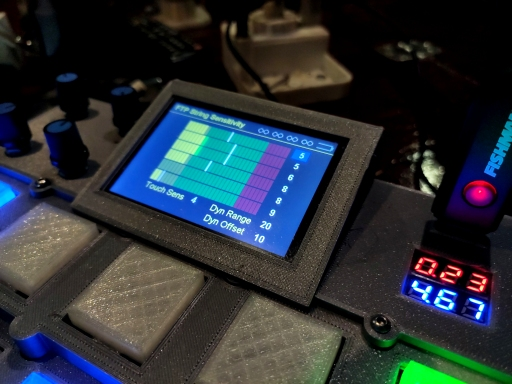
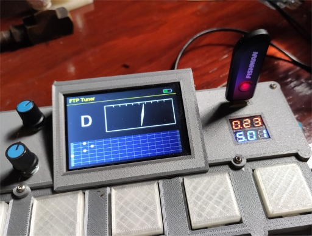

# FTP (Fishman Triple Play) Reverse Engineering and Midi Specificiations

The folder contains historical and more up-to-date results of the last couple
of years of my efforts to reverse engineer the FTP midi specification and behavior.

Some information about those efforts is not present in this directory, but rather
in C++ header and source files in the /arduino project itself, but this page *should*
serve as an entry point to the overall notion of those reverse engineering efforts.

[](../images/ftp_sensitivity.jpg)

Above is a modal dialog window on my device that lets me adjust the string
sensitivity of the FTP dongle/controller.


## A short History and a Rant

I purchased my first FTP in November 2018.   I programmed my first Arduino in
January of 2019.   These were not unrelated incidents.

How I long for the engineering ethics of the 1980's, when you would buy a device,
say a Yamaha FB04 or Kawaii Synthesizer, or maybe a TR-505 drum machine, and included
in the documentation would be a more or less complete specification of how the device
interacted with MIDI, including detailed specs about midi syses messages.

Those days are long gone.

Nowadays when you buy a device, most likely you will not be able to find out anything
about it's midi sysex implementation, although it has one.  For example, there is
an Akai drum-pad that is ubiquitously available, the MPD218.   It comes with a "patch
editor" for Windows (and probably the Mac), that is *adequate* for a consumer to
edit the configuration so that it does what is expected, i.e. when you press a pad,
you can program it to send a MIDI note on-off, or CC message on a given channel.

But nowhere can you find the necessary information to **write** a patch editor for it.

It is a relatively simple device, and I have reverse engineered most of it's sysex, a
topic for another project and discussion, but it rankles me that these manufacturers
have moved away from detailed public MIDI specifications and force the public to rely
solely on platform specific implementations of their choosing (i.e. the MPD218 window
editor).   While that program is adequate, it is also "lame" ... it creates mulitple
instances of the application to deal with each "preset" you are editing, has a convoluted
way of getting around.  For instance, to merely edit one parameter on the device, you
boot one instance of the program "download" the patch from the device, which instantiates
ANOTHER instance of the program, modify the parameter, "upload" the changed patch
through a somewhat complicated relationship with the storage locations on the device,
and then, after that (so you have changed ONE number on the device), you then have to quit
two programs, answering "no" to "do you want to save your changes" messages for each
program ... even though in the first instance you didn't change ANYTHING.

Anyways, I think these manufacturers are missing the point, and a big opportunity, by
NOT publishing their specifications.

And nowhere have I found this to be more true than with the Fishman FTP Triple Play
device and it's midi-implementation and behavior.

Physically, it is a beautiful implementation.   A hardware piece-de-resistance.
Functionally it boasts perhaps the best guitar-to-midi convertor on the planet,
at least from what I've read and been able to surmise, with the best response times,
most accurate tracking, and wonderful features like adjustable string sensitivity.

Yet, as you can read on many forums, and many owners know, it is a complete black
box. It's behavior is exceedingly complicated, as well as undocumented. You are forced
to use Fishman supplied software to do anything useful with it.  Otherwise, if you
don't want to use the Fishman software, you are supposed to think of it as a "generic
compliant USB midi device", though there are "magic" buttons that can be pressed,
and settings in the editor which can (and do) affect its behavior as such.


The whole thing has been very frustrating for me.

I now own two of the devices, as one of the pickups went bad on one of the devices.

I use the device in live gigs, and NEEDED to have a working unit.

----------------------------------------------------------------------------------

It took me about a month to realize that, apart from the crucially necessary
windows version of the FTP configuration editor, I had no use for the literal
mountains of other software FTP provides (foists?) upon their end users.

This was before the iPad specific version of their software, which is nice,
but which also completely misses the mark due to it's lack of external midi
controllability.

I think a large part of it derives from marketting and sales driven forces at Fishman.

In my opinion, Fishman *should have* released the hardware with a detailed description
of the MIDI implementation, and left the software, more or less, up to others to create.
*Maybe* the patch editor would be necessary.

But in today's world of "plugins" and cooperative marketing agreeements, software
bundling agreements, and so on, you get a device that tries to do EVERYTHING,
interface with every kind of software on every platform, but yet, which is
basicially impossible to understand or use separate from THEIR pre-conceived
notion of what software their end users WANT ... and **NEED** ... to use.

So, that's the end of my rant (for now).   Fishman missed the mark totally on the
software/firmware side of their device.   Where they sell 10,000 units now, they
could be selling 100,000 units.   Where they have to create complicated agreements
with software vendors and relationships that they force upon their user, they *should*
have made the internals specifications more public, and taken advantage, rather than
squashing, the larger community of open source and hacker type programmers.

Nonetheless, I have put considerable effort into figuring this damned thing out,
and this repository contains most of those results, though perhaps not in the
most ordered, or organized, presentation.

# Documents in this folders

As this is my initial commit of these materials, I am starting by merely posting that
which I already have, in whatever state it happens to be in.   Below I try to give
an idea of the relevance of each document in this folder.


### [my_devices_midi_descriptors.txt](my_devices_midi_descriptors.txt)

This file contains a dump of the the USB descriptors for various devices that I have owned,
including the FTP, the Akai MPD218, a Softstep2 foot pedal, an "AudioFront" exprssion pedal
to USB midi convertor box, an Akai MPK mini keyboard, and a Behringer UMC4040HD Audio USB
interface.

I created this file in my "early days" with Arduinos and the Ardunio USB Host Shield,
and have referred back to it many, many times, as I have tried, and ultimately suceeeded
in "spoofing" the FTP editor so that I could intercept and learn about the MIDI implementation
of the FTP device.

Others who might *not* be interested in the FTP may still find interest in the descriptors
for one of the other devices therein.


### [FTP_Midi_Analysis.docx](FTP_Midi_Analysis.docx)

This file was also generated using Arduinos (or maybe a teensy) and various Arduino host shield
solutions.  I got quite involved trying to implement an (unpublished) "USB Pass Thru" device that
would allow me to generally spoof any USB (midi) device.  Maybe I'll post that someday.

So, this document has exmples of my earliest efforts to get at the FTP patches via sysex, which
I initially "sort of" got working at an ad-hoc level.  I also got very close (but no cigar)
to understanding how to adjust the FTP string sensitivity and other things, like polymode,
at that point.

I even put some stuff up on the vGutiar forum at that point, including a basic C++ data
structure for the patches on the FTP.   Unfortunately, by the time I got back to the project,
my notes were scattered, and I had to, basically, go through everything again.

But I did.   If you've read this far, keep reading.


### [readme-2020-06-14.txt](readme-2020-06-14.txt)

Of course, one of the things I initially tried right away with the FTP was to use the
**midiOx** program to *get in between* the windows FTP editor and the dongle/controller
so that I could see and learn about the midi messages flying back and forth between the
two.   It is fairly easy to see one side of the conversation (the output FROM the dongle
TO the editor) as the FTP has two "output" ports, and only one of them is really needed
to run the editor.

But it proved difficult (for me) to visualize and get at the TWO-WAY communication that
was taking place.

So, finally, about a month and a half ago (I'm writing this on July 31, 2020) I finally got really
down into it and figured out how to spoof the FTP editor using **loopMidi** and **midiOx**.

This document is/was a "realtime" experimental log, including things that *didn't* work.

At the end of it, I started another MSWORD document (next) so that I could include
pictures and desribe the results mo-better.


### [FinallyFiguredOutMidiOXSpoof.docx](FinallyFiguredOutMidiOXSpoof.docx)

This document purports to explain how YOU TOO (lol) can use **midiOx** and **loopMidi**
to get *in between* the FTP dongle and the Windows FTP editor program so that you can
see the conversation taking place between them.

Somewhere around that magic moment, the flood gates opened and I started getting a
much better idea of how they editor and dongle/controller communicate.

Those efforts have now led to **more information than I can document** sigh/lol.

I ask the interested reader to continue reading.   Most of the really *juicy* stuff
is in C++ header and source files at this time, which I will attempt to link to in the next
major section of this readme file.


### [hardware_patches.csv](hardware_patches.csv)

A CSV (comma delimtied text) file of the original FTP hardware patches created by using the
"export" function from the FTP Windows Editor.

This file was very useful in doing parametric analysis of the patches, so that i could see
WHAT changed when I changed soemthing in the patch editor, without necessarily needing to
see the midi-stream.

It also alludes to some as-yet-unimplemented or previously-implemented-but-now-vestigal
features that Fishman either had in mind and did not implemnt, or have yet to implement
(like an arpegiator).


### [FTP_MIDI_SPEC.xlsm](FTP_MIDI_SPEC.xlsm)

This file is just getting started.   It was my intention to document here, in one place
all of the 0x1F/0x3F commands that the editor uses, and the dongle/controller responds
to.

That sentence will take a little explaining.

But, before I get around to tyring to advance the state of the documentation I have,
as I said, I want to do an initial commit, and get some of this info up on the net,
so for now, please just consider this as an as-yet unfilled framework for presenting
FTP commands and responses.

More later ....


# FTP information in teensyExpression source and header files

As I said, most of the information I have currently accumulated is currently lodged
in various C++ header and source files in the main "teensyExpression" project.

I try to call out the most relevant files containing FTP midi information here.

### [../arduino/teensyExpression/ftp_defs.h](../arduino/teensyExpression/ftp_defs.h)

**This is probably the most important and relevant file for FTP midi
information, in my system, at this time!!**

This file contains the basic C++ data structures for a patch, as well as comments
and constants describing a variety of what I call 1F/3F command and reply
messages that I have ferreted out.

Basically it amounts to the editor sending out PAIRS of midi command messages
and the dongle/control replying with it's own pair

```
   0xBn   0x1F  command              sent by editor
   0xBn   0x3F  param                to controller
```

The editor sends (continuous controller) messages on channel "n+1".

So 0xB1, for example is a message sent out on Midi channel 2.

Command and control of the dongle/controller takes place on Midi Channel 8, so the 'n' in this case is '7'.

Each "command" is typically paird with a "parameter" that the editor can send.

For instance, the command might be "set string sensitivity" and the parameter
might be a bitwise combination of the string number (0..5), and the sensitivity
level (0..15).

After receiving the command, the dongle typically "replies" with the same
command header, but perhaps some other information in the "parameter".

```
   0xB7  0x1F  command              sent by controller
   0xB7  0x3f  reply-value          to the editor
```

--------------------------------

In this H file you will find most of the command/replies that I have identified,
and/or tested, and/or which I use to effect things in the teensyExpression program.

For instance, I was able to implement the "string sensitivity settings"
in [winFTPSensitivity.h](../arduino/teensyExpression/winFTPSensitivity.h) and
[winFTPSensitivity.cpp](../arduino/teensyExpression/winFTPSensitivity.cpp)
as well as a guitar tuner based on the FTP, largely based on the information
available in this H file.

[](../images/tuner.jpg)

also see [winFTPTuner.h](../arduino/teensyExpression/winFTPTuner.h) and
[winFTPTuner.cpp](../arduino/teensyExpression/winFTPTuner.cpp)
