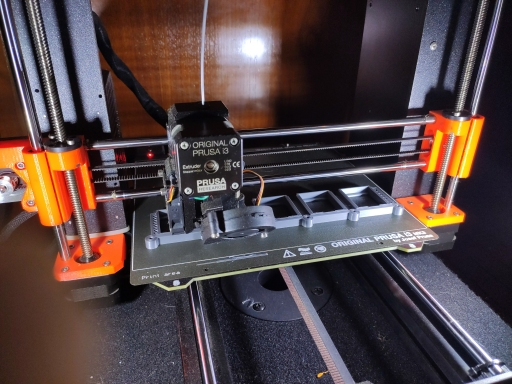
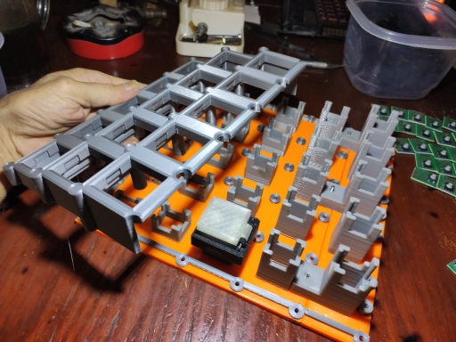

### teensyExpression Fusion, STL, and gcode files

I wont lie to you and say that everything here is well organized.

The file 2020-06-02-MidiPedalFinal_with_fixes v9.f3d contains the most recent, and
most correct, version of the design of this thing.

But I don't believe it contains the actual switches themselves, which were
probably last exported from 2020-05-19-MidiPedal2 v4.f3d

THIS IS THE INITIAL CHECK IN.

I will clean these up and provide a single fusion file, and set of STL
and Prusa specific m3f and gcode files by the time I post this to
thingeeverse.

For now I just wanted to get a version up on the web.

ALL OF THIS IS USER BEWARE, of course!

Use at your own risk!
