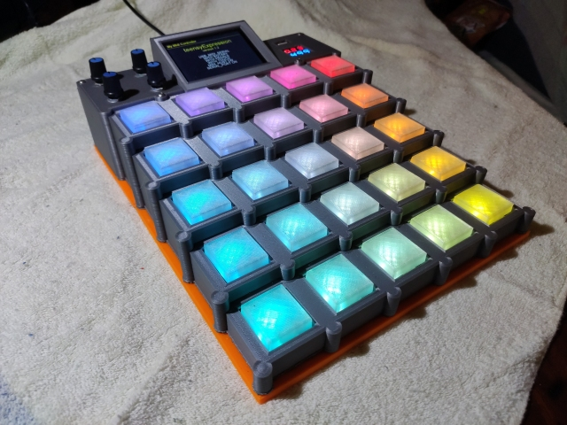
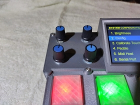
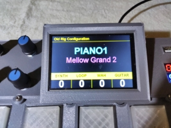
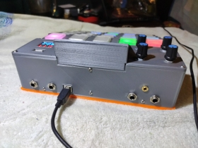
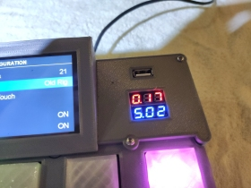
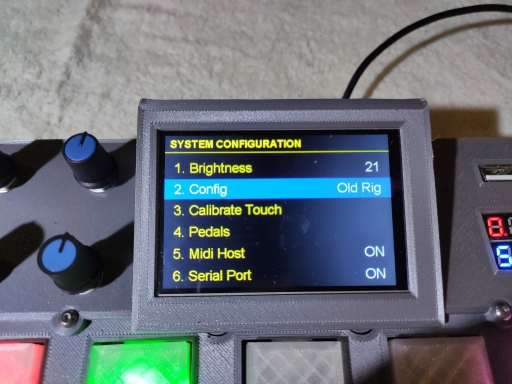

# teensyExpression MIDI controller

This github repository describes and contains the source code and other materials
for a 3D printed, **teensy 3.6** based MIDI controller.  The controller has a 5x5 array
of switches, each with an individually adressable ws2812B colored LED,
four rotary controllers,
a 3.5" touchscreen,
inputs for four (4) standard 1/4" expression pedals, a 1/8" stereo jack used for a serial port, and the main USB type "A" connector,
a USB host port, and, lol, a volt/amp meter to monitor the USB power supply.

*four rotary controllers*

*3.5" touchscreen*

*inputs for four (4) standard 1/4" expression pedals, 1/8" stereo jack for serial port, and the main USB type "A" connector*

*USB host port, and volt/amp meter on USB power supply*

It is intended to be a *foot* controller ... hence the tiered setup which makes it
easier to press buttons with your toes without having to reach over other buttons.
FWIW, I play the guitar barefooted, while sitting in a chair.

There are two major aspects to this project.  First there is the **hardware**, which is
relatively straight forward, and there are circuit diagrams, fusion 360 files, some
instructions, and so on that might allow someone to create a copy if they wanted to.

The second major aspect is the **software**. Inasmuch as this was conceived as BOTH an
experimental platform to let me mess with USB midi, and particularly the **Fishman FTP
Triple Play** dongle/controller, it also has been programmed to fit into my existing
performance setup.  For me, it is "gig ready", as well as a place I can try different
experiments with various things.

The software does not present itself as a general purpose, commercially viable,
consumer product.  Though that could be done, it is not my primary focus. So, while
I would be able to create, for example, a box on which the end user could map the
buttons to various MIDI CC control messages at "run time", that is not currently
implemented.

Because the entire thing can be (fairly) easily programmed from the Arduino IDE,
at this time I am selfishly doing whatever the heck I want in C++.   Some stuff
has been modularized and incorporated into things like a system configuration "preferences"
page, with persistent values stored in EEPROM, other stuff is "hard coded" into the C++, an
approach which limits the use of this by less technically saavy "consumer" or "nubie"
readers and potential users.

That's what it is at this point.

There is still, in my opinion, considerable value in making this public, and so,
here, in the middle of my ongoing development, I am creating a public github
repository so that I can present it in some way, shape, or form.

### Notes on GitHub Snapshot

This repository is a completely separate (denormalized manual branch) of my
ongoing personal developemt environment.  It represents a static moment in
time when everything compiled, was 3D printed, and worked, in a certain way.

The project includes several personal libraries that I have written, along
with a few public libraries that are either necessary to build the thing,
or which I have additionally tweaked to get things working "my way".  That
is not always because it was the best, or most sound engineering approach to
take, but has often been the case because of my lack of a given part, or
sufficient understanding, at a given time, and having to work around those
limitations by sometimes modifying Arduino, Teensy, or other publically
available libraries.

I try to document those kinds of changes, and why I made them, as I go along.

If you are reading this, try not to get too hung up in the specifics.

For example, when I was prototyping the box, I started off using a different, much
faster and more teensy compatible 2.8" SPI touch screen.  One night I burned it, and
because I did not want to wait 6 weeks for a replacement (I live on a remote
island in the tropics) I was forced to go to a slower speed 8 bit parallel
Arduino touch screen ... which in turn required me to port the LCDWIKI library
for it to the teensy 3.6, which I did.

It was not always pretty. Nor necessarily were "best practices" followed :-)

Yet, in the end, I decided it was better to post what I have, warts, wrinkles, and
all, than to wait for some perfect future that might never come around.

An interested reader *may* find a gem they were looking for in this repository.
Or it may just provide general inspiration for creating a similar project.

I dunno. Don't really care :-)

"Let there be songs .... to fill the air"

# Repository Organization

So, apart from this brief introduction, you can find other materials and information in the following
subfolders of this repository

* root directory - contains this readme.md file
* [arduino/](arduino/) - contains the source code and libraries to build the program
    * [arduino/libraries](arduino/libraries/) - mine, and a couple other libraries used in the build
    * [arduino/teensyExpression](arduino/teensyExpression/) - the main INO program and additional classes that are specific to the project
* [fusion/](fusion/) - contains the STL, fusion 360 files, and notes on how to print and assemble the box
* [hardware/](hardware/) - contains the basic schematic, circuit diagrams, and information about the electronics hardware design
* [ftp/](ftp/) - contains separate discussions and documents regarding my reverse engineering efforts on the FTP Triple play dongle and controller

# Credits

Pretty much everything I do has been tremendously influenced by, and is more or less a direct
result of the work done by **Paul Stoffregen** and his wonderful **teensy** series of MPU boards.

Please visit his website at [prjc.com](https://www.prjc.com) and support him by purchasing teensy
boards and teensy related parts and accessories.    He also has github, hackaday, and facebook pages
that you can find easily on the internet. The man's a giant to me, and has forged important new
ground not only with the boards he makes, but also with the **vast** amount of open source
software he has created, not the least of which includes the ws2812 and ili9431 libraries, but
also his audio library, and well, what can you say ... so much more!

Also thanks to the many folks who have contributed to the [lcdwiki](http://www.lcdwiki.com) project.
Though I can't name them by name, many are the times when I have visited their website and utilized
their code.

That's it!

Time for an initial rude, crude, commit.

Thanks for checking this out!

July 2020 - Patrick
